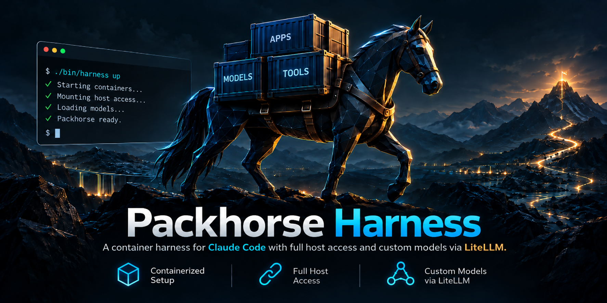

<div align="center">



**English** · [Polski 🇵🇱](README.pl.md)

[](LICENSE)  -lightgrey)

</div>

---

Packhorse runs [Claude Code](https://code.claude.com/docs/en/overview) inside a Docker container that **does not cut you off from your machine** — processes, disks, CPU/RAM/VRAM and the host's Docker are all within reach — and lets you add **your own models** (GLM, Qwen, anything OpenAI-compatible) as extra entries in `/model`, next to Opus and Sonnet. Traffic to those models goes through [LiteLLM](https://github.com/BerriAI/litellm), which translates the Anthropic Messages API into the provider's API.

```
                          ┌─ model from models.yaml ──► litellm:4000 ──► provider (e.g. api.z.ai)
 claude ──► router:8787 ──┤                             (Anthropic → OpenAI)
 (container)              └─ Opus / Sonnet / Haiku ──► api.anthropic.com  (your subscription, 1:1)
      │
      └─ pid: host · privileged · host / at /host · /dev · /sys · GPU · docker.sock
```

## Features

- **External models as first-class citizens** — one entry in [`models.yaml`](models.yaml) becomes a row in `/model`, a LiteLLM route and a name you can use in subagents (`model: glm-5.3-flash`).
- **Subscription stays untouched** — a small router sends Claude models to Anthropic byte-for-byte and only your own models to LiteLLM; the OAuth token never reaches the proxy. A `standalone` mode runs everything through LiteLLM with no Anthropic account at all.
- **Full host visibility** — `ps`/`kill` on host processes, `nvidia-smi`, `smartctl`, `sensors`, the host filesystem under `/host` and the host's Docker daemon.
- **Batteries included for the agent** — Python with `pip` and `uv`, diagnostic tools, a headless browser via [`playwright-cli`](https://github.com/microsoft/playwright-cli) (no MCP server needed), and a built-in `web-fetch` subagent that turns any web page into clean Markdown.
- **Layered Claude Code configuration** — the harness ships its own agents/skills/settings, and can optionally inherit your host `~/.claude` (read-only).
- **Linux and Windows** — Docker Engine on Linux, or Docker Desktop (WSL2) with Git Bash.

> [!WARNING]
> **This is not a sandbox.** The `claude` container is deliberately privileged (`privileged`, `pid: host`, the host filesystem, `docker.sock`, passwordless `sudo`), which is effectively root on the host. Use it on machines you own, and read [Host access](docs/en/host-access.md) before running it.

## Quick start

Requirements: Docker with Compose v2, Bash (Git Bash on Windows), an API key for at least one external model provider, and optionally a Claude subscription.

```bash
git clone https://github.com/lrozewicz/packhorse-harness.git
cd packhorse-harness
cp .env.example .env         # set WORKSPACE_DIR and provider keys (e.g. ZAI_API_KEY)
./bin/harness claude         # starts everything it needs, then the session (run /login, then /model)
```

The first run builds the images and starts the config generator, LiteLLM and the router on its own; when the last session ends, it stops them again. The platform (Linux or Windows), a working NVIDIA GPU and your UID/GID are detected on every run — `./bin/harness doctor` shows what was detected. Optional: `./bin/harness up` starts the services separately and shows their status (also useful after an update, as it rebuilds the router), and `./bin/harness test` sends one request to an external model to check the provider key. `./bin/harness` without arguments lists all commands. Full walkthrough: [Getting started](docs/en/getting-started.md).

## Documentation

| Topic | What you will find |
| --- | --- |
| [Getting started](docs/en/getting-started.md) | installation, `.env`, the `./bin/harness` command, login, workspace |
| [Models](docs/en/models.md) | adding a model in `models.yaml`, router modes, `/model` rows, subagents on external models |
| [Architecture](docs/en/architecture.md) | request path, why a router, what each file does |
| [Host access](docs/en/host-access.md) | privileges, mounts, networking, how to scale access down |
| [Container tooling](docs/en/container-tooling.md) | Python, the browser (`playwright-cli`), MCP servers |
| [Claude Code configuration](docs/en/claude-configuration.md) | config layers, `claude/config/`, inheriting the host `~/.claude` |
| [Windows](docs/en/windows.md) | Docker Desktop + Git Bash, limitations, line endings |
| [Troubleshooting](docs/en/troubleshooting.md) | diagnostics, common symptoms, known pitfalls |
| [Verification](docs/en/verification.md) | what has been tested end-to-end, and what has not |

## License and trademarks

Licensed under the [Apache License 2.0](LICENSE) (see also [NOTICE](NOTICE)). Images built by the harness download their dependencies (Claude Code, LiteLLM, Playwright, Docker CLI, Docker Compose, Docker Buildx, …) from the official sources; each of them has its own license and terms of use.

Packhorse Harness is an independent project and is not affiliated with, endorsed by, or sponsored by Anthropic. "Claude" and "Claude Code" are trademarks of Anthropic, PBC. Docker, Playwright, LiteLLM, GLM and other names are trademarks of their respective owners and are used here only to describe compatibility.
